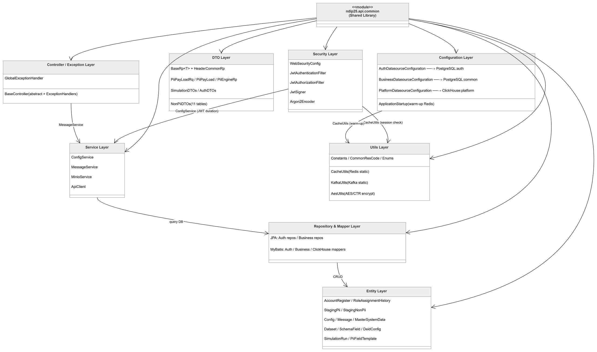
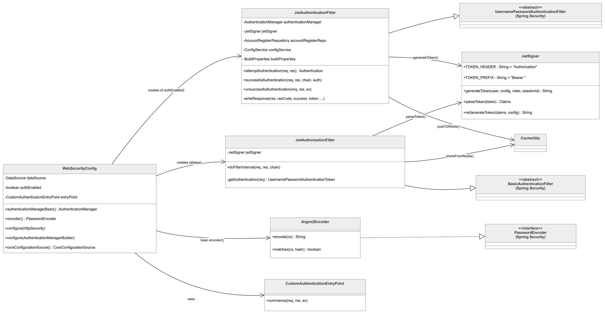
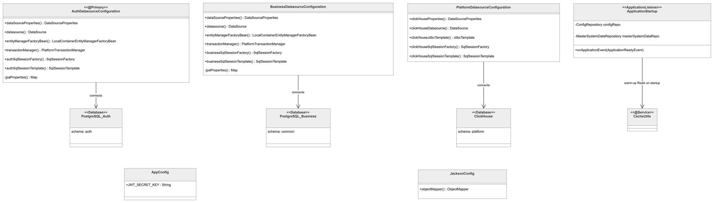
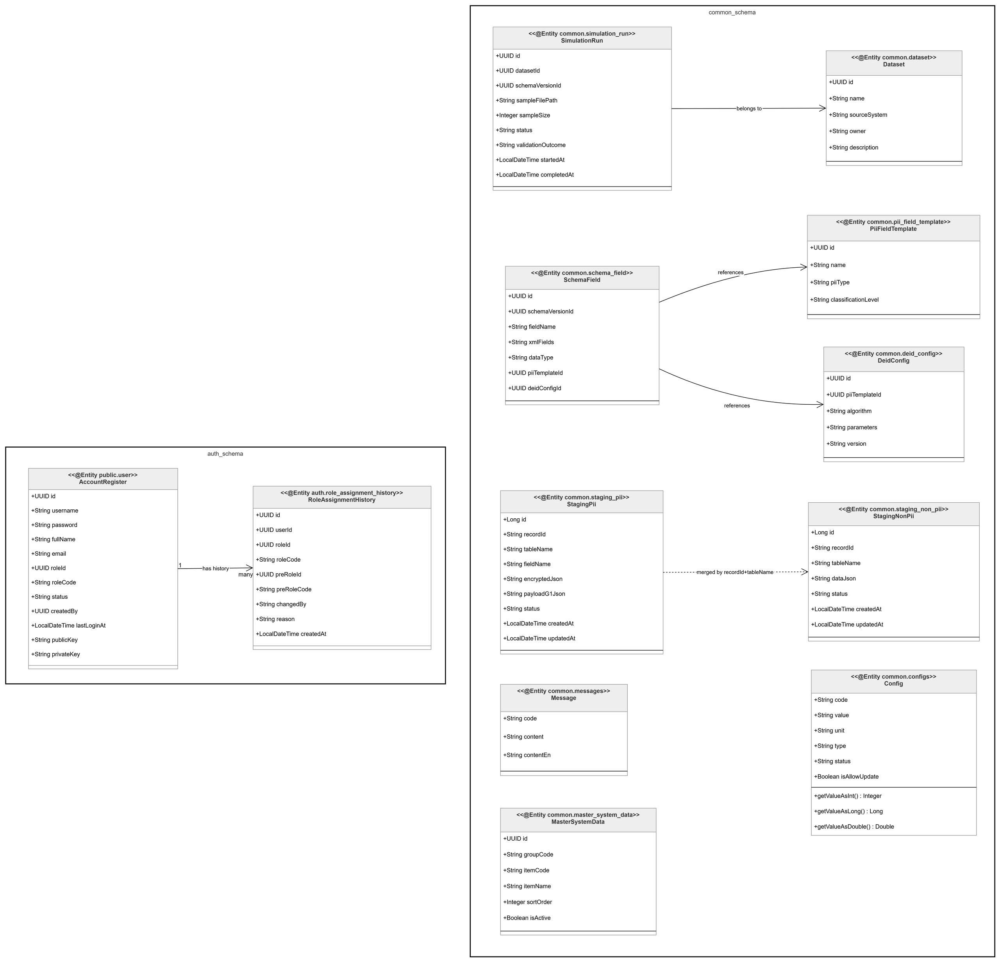
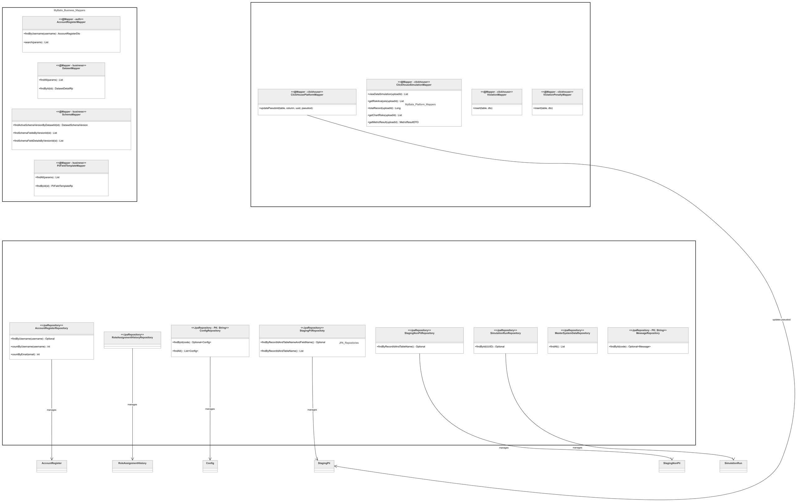
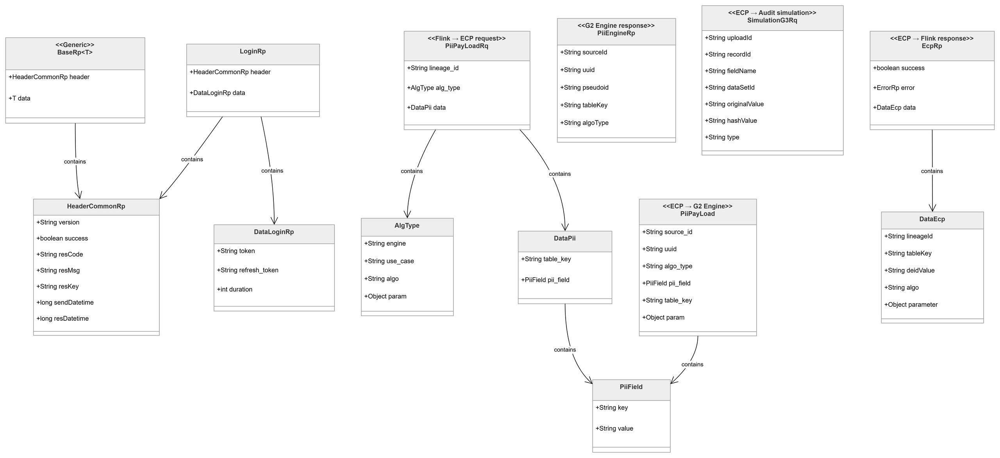
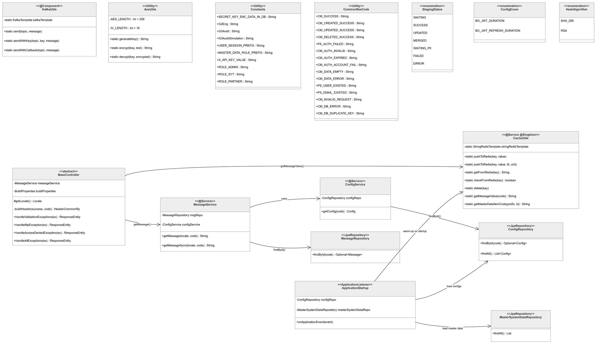

# Báo cáo phân tích: `ndip25.api.common`

> **Tác giả:** Duc Long  
> **Ngày:** 2026-04-14  
> **Module:** `ndip25.api.common` — Shared Library cho toàn hệ thống NDIP25

---

## 1. Tổng quan

`ndip25.api.common` là **thư viện dùng chung (shared library)** — không chạy độc lập mà được 4 service khác import vào:

| Service dùng library | Vai trò |
|---|---|
| `ndip25.api.platform.auth` | Dùng Security, Entity auth, Repository auth |
| `ndip25.api.bussiness.admin` | Dùng Entity business, Mapper, DTO, Utils |
| `ndip25.etl.ecp` | Dùng Entity staging, ClickHouse mapper, Utils |
| `ndip25.etl.audit` | Dùng Entity staging, ClickHouse mapper, Utils |

**Build:** Gradle 7.1.1+ | **Java:** 11 | **Version:** 1.0.5  
**Output:** `.jar` library (không phải executable — `bootJar disabled`)

Để dùng, các service chạy:
```bash
./gradlew clean build publishToMavenLocal -x test
```

---

## 2. Phân lớp kiến trúc

```
ndip25.api.common/
│
├── security/           Layer 1: Xác thực & phân quyền (JWT, Argon2, WebSecurity)
├── configuration/      Layer 2: Cấu hình datasource, startup, AppConfig
├── entity/             Layer 3: JPA Entity — ánh xạ bảng DB
├── repository/         Layer 4: Spring Data JPA repositories
├── mappers/            Layer 4: MyBatis mappers (SQL phức tạp)
├── dto/                Layer 5: Data Transfer Objects (Request/Response)
├── service/            Layer 6: ConfigService, MessageService, MinioService
├── utils/              Layer 6: CacheUtils, KafkaUtils, AesUtils, Constants
├── controller/         Layer 7: BaseController (abstract + exception handlers)
├── exception/          Layer 7: GlobalExceptionHandler
└── validation/         Layer 8: Custom validators
```



---

## 3. Layer 1 — Security



### 3.1 `WebSecurityConfig`

Cấu hình toàn bộ Spring Security chain. Kế thừa `WebSecurityConfigurerAdapter`.

**Public endpoints (không cần JWT):**
- `/actuator/**`, `/healthz` — health check
- `/api/pii/push`, `/api/non-pii/push` — Flink → Audit (internal)
- `/proxy/g2/process-data` — Flink → ECP (internal)
- `/api/v1/user/admin/init` — khởi tạo admin lần đầu
- `/swagger-ui/**`, `/v3/api-docs/**` — Swagger docs

**Cơ chế kích hoạt login:**
```java
// Chỉ Auth service mới bật, các service khác tắt
if (authEnabled) {  // spring.datasource.auth.enabled=true
    http.addFilter(new JwtAuthenticationFilter(...));
}
// JwtAuthorizationFilter luôn chạy ở mọi service
```

**JDBC Authentication query:**
```sql
-- Kiểm tra user tồn tại & active
SELECT username, password,
       CASE status WHEN 'active' THEN 1 ELSE 0 END enabled
FROM public.user WHERE username=?

-- Gán quyền mặc định 'login' cho mọi user
SELECT username, 'login' FROM public.user WHERE username=?
```

---

### 3.2 `JwtSigner`

Tạo và parse JWT token bằng thư viện JJWT 0.11.0.

**JWT Claims (payload):**
```json
{
  "username":    "nguyen.van.a",
  "session_id":  "uuid-random-mỗi-lần-login",
  "ut":          "admin",
  "email":       "a@gtel.vn",
  "authorities": ["login", "admin"]
}
```

**Ký bằng:** HS256 (HMAC-SHA256) + `JWT_SECRET_KEY` từ `application.properties`  
**TTL:** Đọc từ bảng `common.configs` key `BO_JWT_DURATION` (phút) — không hardcode

---

### 3.3 `JwtAuthenticationFilter`

Xử lý `POST /login`. Kế thừa `UsernamePasswordAuthenticationFilter`.

**Luồng xử lý:**

```
1. attemptAuthentication()
   ├── Đọc body JSON → lấy username, password
   └── authenticationManager.authenticate() → Spring query DB + Argon2.verify()

2. successfulAuthentication() — khi đúng mật khẩu
   ├── Lấy TTL từ ConfigRepository (BO_JWT_DURATION, BO_JWT_REFRESH_DURATION)
   ├── Tạo sessionId = UUID.randomUUID()
   ├── accessToken  = JwtSigner.generateToken(user, shortTTL, roles, sessionId)
   ├── refreshToken = JwtSigner.generateToken(user, longTTL, roles, sessionId)
   ├── Redis: SET "{sessionId}-jwt-re-token" = "refreshToken" (TTL = refresh duration)
   ├── Redis: SET "USER_SESSION_{sessionId}" = userUUID
   ├── DB: UPDATE auth.user SET last_login_at = NOW()
   └── Response: {token, refresh_token, duration}

3. unsuccessfulAuthentication() — khi sai mật khẩu
   ├── BadCredentialsException     → CM_AUTH_ACCOUNT_FAIL (401)
   ├── AuthRequestInvalidException → CM_INVALID_REQUEST (400)
   └── Exception khác              → PS_AUTH_FAILED (401)
```

`@ConditionalOnProperty(prefix="endpoint.login", name="enabled", havingValue="true")` — chỉ khởi tạo filter khi config bật.

---

### 3.4 `JwtAuthorizationFilter`

Validate JWT trên **mọi request** (trừ public endpoints). Kế thừa `BasicAuthenticationFilter`.

**Luồng xử lý:**
```
1. Đọc header: "Authorization: Bearer <token>"
2. JwtSigner.parseToken(token) → verify HS256 signature + check expiration
3. Lấy session_id từ claims
4. CacheUtils.checkFromRedis("{sessionId}-jwt-re-token")
   ├── Key tồn tại → session còn hiệu lực → tiếp tục
   └── Key không tồn tại → user đã logout → trả null → 401
5. Build UsernamePasswordAuthenticationToken với authorities
6. SecurityContextHolder.setAuthentication(token)
```

**Cơ chế logout:** Chỉ cần `CacheUtils.delete("{sessionId}-jwt-re-token")` → mọi request tiếp theo bị từ chối dù JWT chưa expire.

---

### 3.5 `Argon2Encoder`

Implement `PasswordEncoder` (Spring Security interface).

```
encode(password)       → Argon2id hash (memory-hard, chống GPU brute-force)
matches(raw, encoded)  → verify password vs hash
```

---

## 4. Layer 2 — Configuration



### 4.1 Multi-Datasource

Một service có thể kết nối **3 database** đồng thời:

| Class | Bean qualifier | Database | Scan package |
|---|---|---|---|
| `AuthDatasourceConfiguration` | `authDatasource` (@Primary) | PostgreSQL schema `auth` | `sdeg.api.entity.auth` |
| `BusinessDatasourceConfiguration` | `businessDatasource` | PostgreSQL schema `common` | `sdeg.api.entity.business` |
| `PlatformDatasourceConfiguration` | `clickHouseDatasource` | ClickHouse schema `platform` | — (chỉ MyBatis) |

Kích hoạt có điều kiện:
```properties
spring.datasource.auth.enabled=true/false
spring.datasource.clickhouse.enabled=true/false
```

Mỗi datasource có: `DataSourceProperties` → `DataSource` → `EntityManagerFactory` (JPA) + `SqlSessionFactory` (MyBatis) + `TransactionManager`.

Hibernate tự tạo/update bảng: `hibernate.hbm2ddl.auto=update`

---

### 4.2 `AppConfig`

Đọc secrets từ `application.properties` vào static field:

```java
AppConfig.Security.JWT_SECRET_KEY      // ký JWT
AppConfig.Security.PASSWORD_SECRET_KEY // mã hóa password
AppConfig.RestTemplateConfig.TIMEOUT   // timeout HTTP calls
AppConfig.ENV                          // production/local/dev
```

---

### 4.3 `ApplicationStartup`

Chạy sau khi Spring Boot khởi động xong (`ApplicationReadyEvent`).

**Warm-up Redis cache:**
```
1. Đọc common.configs → Redis (vĩnh viễn, không TTL)
   "BO_JWT_DURATION" → "60"
   "data_sync_config_CM_SUCCESS" → "Thành công"

2. Đọc MasterSystemData (isActive=true) → Redis
   "MASTER_DATA_{GROUP}_{UUID}" → JSON {id, group_code, item_code, item_name}
```

---

## 5. Layer 3 — Entity



### Schema `auth`

**`AccountRegister`** — `public.user`
```
id          UUID        PK auto-generate
username    VARCHAR     NOT NULL, UNIQUE
password    VARCHAR     Argon2id hash
roleId      UUID        FK → master_system_data
roleCode    VARCHAR     "admin"/"syt"/"partner" (denormalized — tránh JOIN lúc validate JWT)
status      VARCHAR     "active"/"inactive"
lastLoginAt TIMESTAMP   cập nhật mỗi lần login
publicKey   TEXT        RSA public key (dự phòng ký số)
privateKey  TEXT        RSA private key (dự phòng ký số)
```

**`RoleAssignmentHistory`** — `auth.role_assignment_history`  
Audit trail — ghi lại mọi lần thay đổi role: userId, roleId mới, preRoleId cũ, changedBy, reason.

---

### Schema `common`

**`StagingPii`** — `common.staging_pii`  
Bảng trung gian tracking trạng thái PII encryption:
```
recordId      String   UUID record gốc từ XML
tableName     String   "violation" / "violation_penalty"
fieldName     String   "licensePlateHash" / "violatorNameHash"
encryptedJson TEXT     JSON pseudoid từ G2: {"licensePlateHash": "a3f1c2..."}
payloadG1Json TEXT     payload gốc gửi lên G2 Engine
status        String   WAITING → SUCCESS → MERGED (hoặc FAILED)
```

Vòng đời:
```
Flink gửi lên ECP         → INSERT  status=WAITING
G2 trả về pseudoid         → UPDATE  status=SUCCESS, encryptedJson=pseudoid
Audit merge xong           → UPDATE  status=MERGED
G2 Engine lỗi             → UPDATE  status=FAILED
```

**`StagingNonPii`** — `common.staging_non_pii`
```
recordId   String  UUID record gốc
tableName  String  "violation" / "driver_license"
dataJson   TEXT    toàn bộ non-PII fields dạng JSON
status     String  SUCCESS → WAITING_PII → MERGED (hoặc ERROR)
```

**`Config`** — `common.configs`
```
code    PK: "BO_JWT_DURATION", "BO_JWT_REFRESH_DURATION"
value   "60", "1440"
type    "integer" / "string" / "long" / "double"
```
Helper: `getValueAsInt()`, `getValueAsLong()`, `getValueAsDouble()`.

**`MasterSystemData`** — `common.master_system_data`  
Danh mục tham chiếu: roles, statuses... Key: `groupCode` + `itemCode`.

**Chuỗi metadata dataset:**
```
DataSource (đơn vị cung cấp, VD: Cục CSGT)
  └── Dataset (tập dữ liệu, VD: Vi phạm giao thông)
        └── DatasetSchemaVersion (phiên bản: Active/Draft/Archived)
              └── SchemaField (từng field)
                    ├── PiiFieldTemplate (loại PII: biển số, CMND, tên...)
                    └── DeidConfig (thuật toán: sha256, pseudonymization)
```

**`SimulationRun`** — `common.simulation_run`  
Tracking simulation: datasetId, sampleFilePath, sampleSize, status (PENDING → RUNNING → COMPLETED).

---

## 6. Layer 4 — Repository & Mapper



### JPA Repositories

| Repository | Các method quan trọng |
|---|---|
| `AccountRegisterRepository` | `findByUsername()`, `countByUsername()`, `countByEmail()` |
| `StagingPiiRepositoty` | `findByRecordIdAndTableNameAndFieldName()`, `findByRecordIdAndTableNameAndFieldNameAndStatus()` |
| `StagingNonPiiRepository` | `findByRecordIdAndTableName()` |
| `ConfigRepository` | `findById(code)`, `findAll()` |
| `SimulationRunRepository` | `findById(UUID)` |

### MyBatis Mappers — Java Interface

| Mapper | Nhiệm vụ |
|---|---|
| `AccountRegisterMapper` | `searchAccounts()`, `countAccounts()` — tìm kiếm user phân trang |
| `SchemaMapper` | `findActiveSchemaVersionByDatasetId()`, `findSchemaFieldDetailsByVersionId()` — Flink load PII config |
| `DatasetMapper` | `searchDatasets()`, `getDatasetDetailById()` — danh sách dataset |
| `ClickHousePlatformMapper` | `updatePseudoId()` — cập nhật pseudoid sau khi G2 xử lý |
| `ClickHouseSimulationMapper` | `getRiskAnalysis()`, `getChartRisks()`, `getMetricResult()` — privacy risk |
| `ViolationMapper` | `insert()` — ghi record vào platform.violation |

### MyBatis XML — Kỹ thuật quan trọng

**Dynamic SQL** (`AccountRegisterMapper.xml`):
```xml
<where>
    role_code != 'admin'
    <if test="username != null and username != ''">
        AND username ILIKE CONCAT('%', #{username}, '%')
    </if>
</where>
```

**LEFT JOIN LATERAL** (`DatasetMapper.xml`) — lấy schema version mới nhất mỗi dataset:
```sql
LEFT JOIN LATERAL (
    SELECT version FROM dataset_schema_version
    WHERE dataset_id = d.id AND status = 'Active'
    ORDER BY created_at DESC LIMIT 1
) latest_schema ON true
```

**K-Anonymity query** (`ClickHouseSimulationMapper.xml`):
```sql
-- Gom tất cả QI fields của mỗi record thành chuỗi "field=value|..."
arrayStringConcat(
    arraySort(groupUniqArray(concat(field, '=', origin_value))), '|'
) AS qi_combination
-- Đếm số record có cùng tổ hợp QI → classSize
-- k = min(classSize) → k nhỏ = rủi ro cao
```

**ClickHouse UPDATE** (`ClickHousePlatformMapper.xml`):
```xml
<update id="updatePseudoId">
    ALTER TABLE ${tableName}        -- ${}  tên bảng (string substitution)
    UPDATE ${columnName} = #{pseudoId}  -- #{} value (parameterized)
    WHERE id = #{uuid}
</update>
```

---

## 7. Layer 5 — DTO



### Response format chuẩn

```json
{
  "header": {
    "version": "1.0.5",
    "success": true,
    "res_code": "CM_SUCCESS",
    "res_msg": "Thành công",
    "send_datetime": 1710701400000,
    "res_datetime": 1710701400050
  },
  "data": { ... }
}
```

### Chuỗi PII DTOs theo luồng

```
Flink → ECP:      PiiPayLoadRq { lineage_id, alg_type, data: { table_key, pii_field } }
ECP → G2 Engine:  PiiPayLoad   { source_id, uuid, algo_type, pii_field, table_key }
                  Encoding: JSON → Base64 → { "data": "<base64>" }
G2 → ECP:         PiiEngineRp  { sourceId, uuid, pseudoid, tableKey, algoType }
ECP → Flink:      EcpRp        { success, error, data: DataEcp { deidValue } }
ECP → Audit:      SimulationG3Rq { uploadId, recordId, originalValue, hashValue, type }
```

### Simulation DTOs

```
RiskAnalysiRp {
  privacyScore: PrivacyScoreDTO { singlingOut, kAnonymity, riskDistribution }
  metricResult: MetricResultDTO { maxRisk, avgRisk, highRiskRecordCount }
  chartRisks:   List<ChartRisk> { band, recordCount, percentage }
}
```

---

## 8. Layer 6 — Utils & Services



### `CacheUtils` — Redis static wrapper

```java
// Static pattern: inject 1 lần, dùng mọi nơi kể cả non-Spring bean
CacheUtils.pushToRedis(key, value, ttl, TimeUnit.MINUTES)
CacheUtils.getFromRedis(key)
CacheUtils.checkFromRedis(key)   // → boolean
CacheUtils.delete(key)
CacheUtils.getMessageValue(code) // → lấy message text từ Redis
CacheUtils.getMasterDataItemCode(prefix, id) // → lấy item_code từ master data JSON
```

**Redis key patterns:**
```
{sessionId}-jwt-re-token      → session token (delete = logout)
USER_SESSION_{sessionId}       → user UUID
data_sync_config_{code}        → message text
MASTER_DATA_{GROUP}_{UUID}     → master data JSON
```

### `KafkaUtils` — Kafka Producer static wrapper

```java
KafkaUtils.send(topic, message)            // Fire-and-forget
KafkaUtils.sendWithKey(topic, key, msg)    // Có key → đảm bảo thứ tự
KafkaUtils.sendWithCallback(topic, msg)    // Có callback log
```

### `AesUtils` — Mã hóa AES/CTR/NoPadding

```
encrypt: sinh IV ngẫu nhiên (16 bytes) → AES/CTR encrypt → Base64URL([IV + cipher])
decrypt: Base64URL decode → tách IV (bytes 0-15) + cipher → AES/CTR decrypt
```

CTR mode không padding, mỗi lần encrypt ra kết quả khác nhau nhờ IV ngẫu nhiên.

### `Constants`

```java
Constants.Url.G2Eng              // "https://tnt.gtelcds.vn/api/v1/deid"
Constants.Url.G3Audit            // "http://10.6.8.37:5001/api/pii/push"
Constants.Redis.USER_SESSION_PREFIX
Constants.Roles.ADMIN / SYT / PARTNER / FACILITY
Constants.HeaderRq.X_API_KEY_VALUE  // API key gửi G2 Engine
Constants.TABLE_COLUMNS             // Map<tableName, Set<allowedColumns>>
```

### `CommonResCode`

```
CM_SUCCESS / CM_CREATED_SUCCESS / CM_UPDATED_SUCCESS / CM_DELETED_SUCCESS
CM_AUTH_INVALID / CM_AUTH_EXPIRED / CM_AUTH_ACCOUNT_FAIL
CM_DATA_EMPTY / CM_DATA_ERROR / CM_DB_DUPLICATE_KEY
PS_USER_EXISTED / PS_EMAIL_EXISTED / PS_ROLE_INVALID
CM_INVALID_REQUEST / CM_SYSTEM_ERROR
```

Prefix: `CM_` = Common (dùng chung), `PS_` = Platform Specific.

### `Enums`

```java
enum StagingStatus { WAITING, SUCCESS, UPDATED, MERGED, WAITING_PII, FAILED, ERROR }
enum Config        { BO_JWT_DURATION, BO_JWT_REFRESH_DURATION }
enum HashAlgorithm { SHA_256, RSA }
enum Env           { PRODUCTION, LOCAL, DEV }
enum Locale        { VIETNAMESE("vi"), ENGLISH("en") }
```

### `ConfigService`

```java
// Lấy config từ DB theo enum key
Config getConfig(Enums.Config code)
// VD: getConfig(BO_JWT_DURATION) → Config{value="60", type="integer"}
// TODO: cần implement cache (hiện đang query DB mỗi lần)
```

### `MessageService`

```java
// Lấy message text theo locale từ bảng common.messages
String getMessage(Locale locale, String code)
// VD: getMessage(vi, "CM_SUCCESS") → "Thành công"
//     getMessage(en, "CM_SUCCESS") → "Success"
```

---

## 9. Layer 7 — Controller & Exception

### `BaseController` (abstract)

Tất cả Controller đều `extends BaseController`.

**`buildHeader(success, code)`** — build `HeaderCommonRp`:
1. Đọc message từ Redis cache (`CacheUtils.getMessageValue(code)`)
2. Fallback sang `MessageService.getMessage()` nếu cache miss
3. Ghi `send_datetime` từ `request.getAttribute("start-time")`

**Exception handlers:**

| Exception | HTTP | Mô tả |
|---|---|---|
| `MethodArgumentNotValidException` | 400 | Validation lỗi, trả map field → message |
| `NlpException` | 200 | Custom exception với res_code |
| `AccessDeniedException` | 403 | Không đủ quyền |
| `HttpRequestMethodNotSupportedException` | 405 | Sai HTTP method |
| `Exception` | 500 | Lỗi không xác định |

### `GlobalExceptionHandler`

```java
@RestControllerAdvice
public class GlobalExceptionHandler extends BaseController {
    // Kế thừa toàn bộ @ExceptionHandler từ BaseController
    // Áp dụng cho tất cả Controllers trong service
}
```

---

## 10. Luồng dữ liệu chính

### Luồng Login

```
Client → POST /login
  → JwtAuthenticationFilter.attemptAuthentication()
    → Spring JDBC: SELECT FROM public.user WHERE username=?
    → Argon2Encoder.matches(rawPwd, hashedPwd)
  → successfulAuthentication()
    → ConfigRepository.findById(BO_JWT_DURATION)       [DB]
    → JwtSigner.generateToken(accessToken + refreshToken)
    → CacheUtils.pushToRedis("{uuid}-jwt-re-token")    [Redis]
    → CacheUtils.pushToRedis("USER_SESSION_{uuid}")    [Redis]
    → AccountRegisterRepository.save(lastLoginAt=now)  [DB]
  → Response: {token, refresh_token, duration}
```

### Luồng Request có JWT

```
Client → Request (Authorization: Bearer <token>)
  → JwtAuthorizationFilter
    → JwtSigner.parseToken(token)           // verify + parse
    → CacheUtils.checkFromRedis("{sid}-jwt-re-token") // session check
    → SecurityContextHolder.setAuthentication()
  → Controller xử lý request
  → BaseController.buildHeader()
    → CacheUtils.getMessageValue(code)      // message từ Redis
```

### Luồng PII Processing

```
Flink → ECP: POST /proxy/g2/process-data (PiiPayLoadRq)
  → ECP: StagingPiiRepositoty.save(status=WAITING)         [PostgreSQL]
  → ECP: HTTP POST G2 Engine {"data": base64(PiiPayLoad)}
  → G2:  trả về {"data": base64(PiiEngineRp {pseudoid})}
  → ECP: StagingPiiRepositoty.save(status=SUCCESS)         [PostgreSQL]
  → ECP: HTTP POST Audit /api/pii/push {"data": base64(PiiEngineRp)}
  → Audit: ClickHousePlatformMapper.updatePseudoId(...)    [ClickHouse]
  → Audit: StagingPiiRepositoty.save(status=SUCCESS)       [PostgreSQL]
```

### Luồng Warm-up khi khởi động

```
Spring Boot ready → ApplicationStartup.onApplicationEvent()
  → ConfigRepository.findAll()                    [DB]
  → CacheUtils.pushToRedis("BO_JWT_DURATION", "60")
  → CacheUtils.pushToRedis("data_sync_config_CM_SUCCESS", "Thành công")
  → MasterSystemDataRepository.findAll()          [DB]
  → CacheUtils.pushToRedis("MASTER_DATA_ROLE_{uuid}", JSON)
```

---

## 11. Điểm đáng chú ý

### Design decisions

| Quyết định | Lý do |
|---|---|
| Static `CacheUtils` / `KafkaUtils` | `JwtAuthenticationFilter` tạo bằng `new`, không inject được bình thường |
| JWT TTL từ DB (`Config`) | Thay đổi TTL không cần redeploy |
| `roleCode` denormalize vào `AccountRegister` | Tránh JOIN khi validate JWT mỗi request |
| `StagingPii` + `StagingNonPii` | Đảm bảo PII và Non-PII đến đủ trước khi merge vào ClickHouse |
| Argon2 thay bcrypt | Memory-hard → chống brute-force GPU hiệu quả hơn |
| `${}` vs `#{}` trong MyBatis | `${}` cho tên bảng/cột, `#{}` cho values (tránh SQL injection) |
| `@ConditionalOnProperty` | Mỗi service chỉ load datasource nó cần |
| ClickHouse dùng `ALTER TABLE UPDATE` | Cú pháp đặc thù ClickHouse, khác SQL chuẩn |

### TODO chưa hoàn thiện trong code

```java
// ConfigService.java
// TODO: lấy từ cache  ← đang query DB mỗi lần thay vì đọc Redis

// JwtAuthorizationFilter.java
// TODO: thêm xử lý nếu token = null lưu lại thông tin (ip, ...)

// WebSecurityConfig.java
// FIXME: lấy đúng theo role  ← đang hardcode 'login' cho mọi user

// MessageService.java
// des.replace(keyReplace, ...) ← logic replace $1, $2 trong message chưa implement xong
```

---

## 12. Diagram tham khảo

| Diagram | Nội dung |
|---|---|
|  | WebSecurityConfig, JwtAuthenticationFilter, JwtAuthorizationFilter, JwtSigner, Argon2Encoder |
|  | 3 Datasource configurations, ApplicationStartup |
|  | Tất cả JPA Entity và quan hệ |
|  | PiiPayLoadRq, PiiEngineRp, BaseRp, LoginRp |
|  | CacheUtils, KafkaUtils, AesUtils, Constants, Enums |
|  | JPA Repositories, MyBatis Mappers |
|  | Toàn bộ dependency giữa các layer |