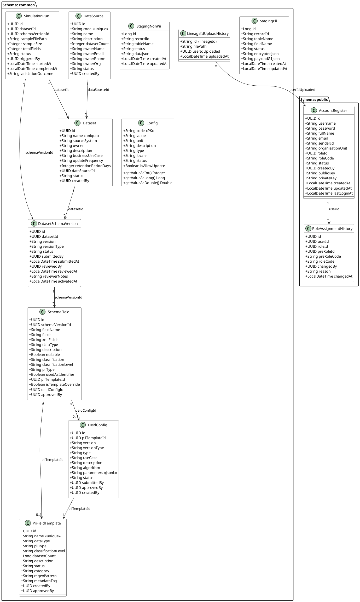
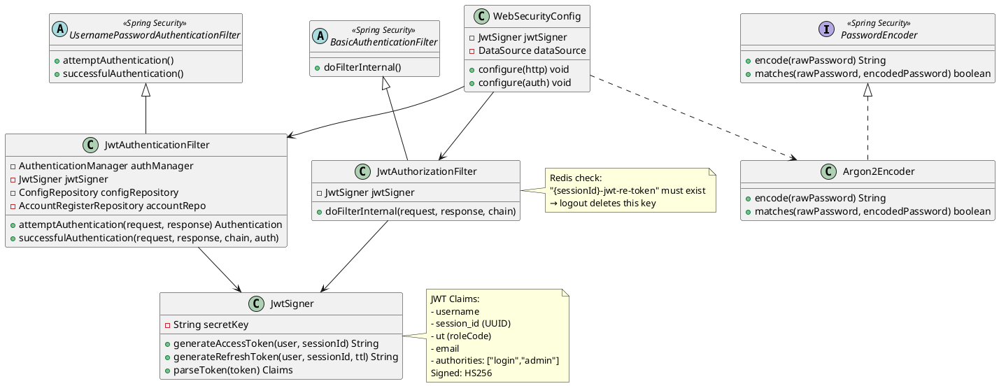
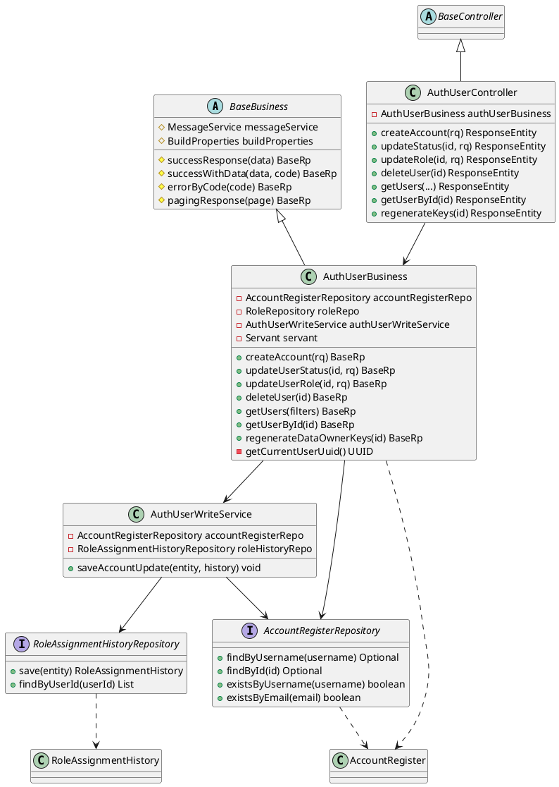
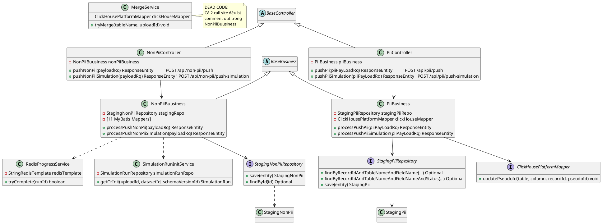
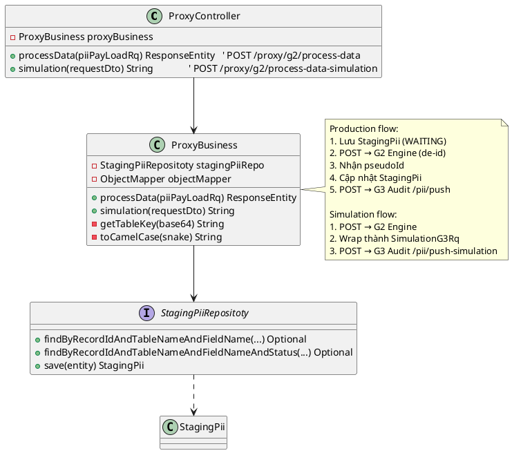
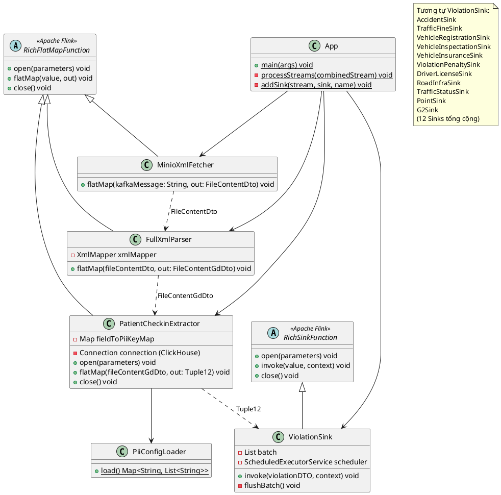
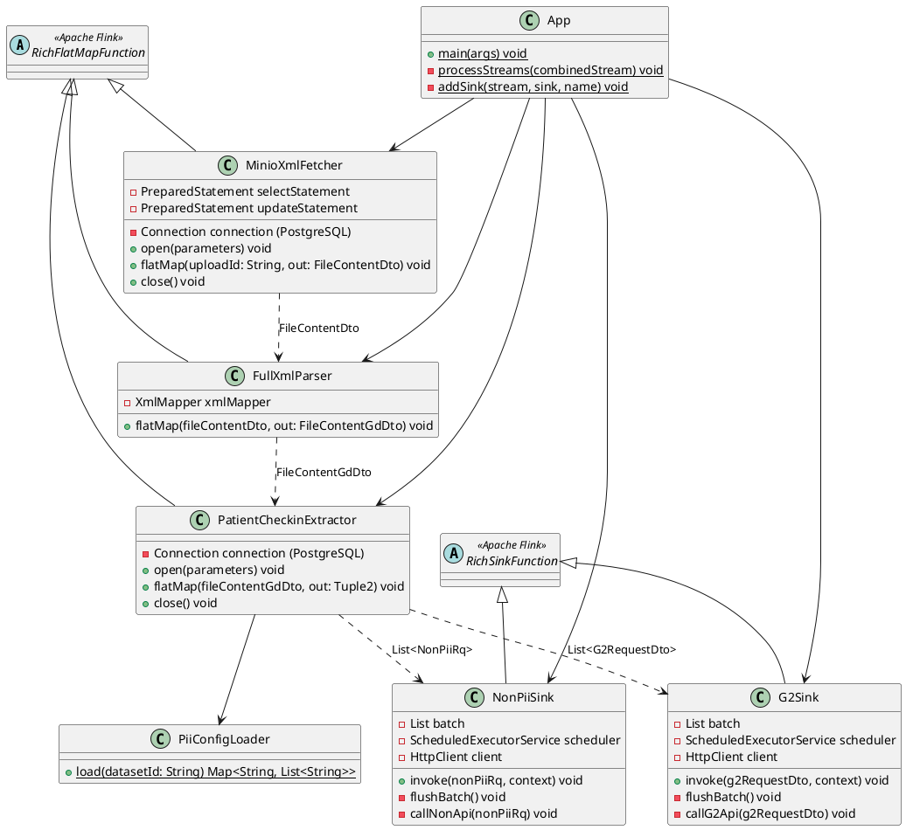
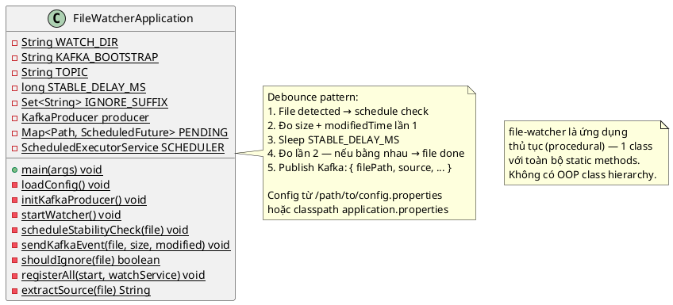
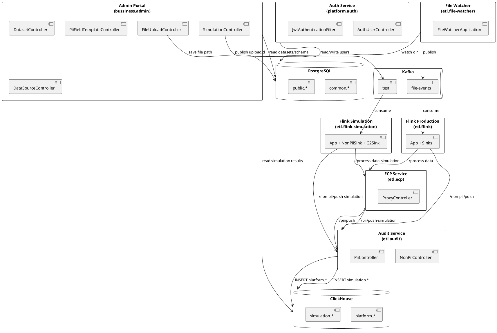

# Class Diagram — Hệ thống NDIP25

> **Ngày:** 2026-04-15
> **Phạm vi:** Toàn bộ 8 module

---

## Đánh giá tổng quan

| Module | Có class diagram? | Lý do |
|---|---|---|
| `ndip25.api.common` | ✅ Entity Model | Toàn bộ domain entity, repository, security |
| `ndip25.api.platform.auth` | ✅ Layered Architecture | Controller → Business → Repository |
| `ndip25.api.bussiness.admin` | ✅ Layered Architecture | 5 feature module rõ ràng |
| `ndip25.etl.audit` | ✅ Layered Architecture | Business + Mapper + Repository |
| `ndip25.etl.ecp` | ✅ Đơn giản | 2 class chính |
| `ndip25.etl.flink` | ✅ Pipeline / Inheritance | Flink class hierarchy |
| `ndip25.etl.flink-simulation` | ✅ Pipeline / Inheritance | Tương tự flink, có khác biệt |
| `ndip25.etl.file-watcher` | ⚠️ Không phù hợp | 1 class static duy nhất |

---

## 1. Domain Entity Model (ndip25.api.common)

Đây là **core domain** của toàn hệ thống — tất cả module khác đều dùng chung entity này.

---

## 2. Security Layer (ndip25.api.common — security)

---

## 3. Application Layer — ndip25.api.platform.auth

---

## 4. Application Layer — ndip25.api.bussiness.admin

```plantuml
@startuml BussinessAdmin_Service

abstract class BaseBusiness {
    #successResponse(data) BaseRp
    #errorByCode(code) BaseRp
    #pagingResponse(page) BaseRp
}

abstract class BaseController {
}

' === Dataset Feature ===
class DatasetBusiness extends BaseBusiness {
    -DatasetRepository datasetRepo
    -DatasetSchemaVersionRepository schemaVersionRepo
    -SchemaFieldRepository schemaFieldRepo
    -DeidConfigRepository deidConfigRepo
    +getDatasets(source,status,search,page,size) BaseRp
    +getDatasetById(id) BaseRp
    +getDatasetSchemaFields(id) BaseRp
    +getDatasetSchemaFieldsByVersion(datasetId,versionId) BaseRp
    +getDatasetVersions(id) BaseRp
    ' Hides deidConfig for NonPII fields
}

class DatasetController extends BaseController {
    -DatasetBusiness datasetBusiness
    +getDatasets(...) ResponseEntity         ' GET /api/v1/datasets
    +getDatasetById(id) ResponseEntity       ' GET /api/v1/datasets/{id}
    +getDatasetSchemaFields(id) ResponseEntity
    +getDatasetSchemaFieldsByVersion(id,vid) ResponseEntity
    +getDatasetVersions(id) ResponseEntity
}

' === DataSource Feature ===
class DataSourceBusiness extends BaseBusiness {
    -DataSourceRepository dataSourceRepo
    -Servant servant
    +getDatasources(source,search,page,size) BaseRp
    ' BUG: createdBy = null — returns all datasources
}

class DataSourceController extends BaseController {
    -DataSourceBusiness dataSourceBusiness
    +getDatasources(...) ResponseEntity      ' GET /api/v1/datasources
}

' === PII Template Feature ===
class PiiFieldTemplateBusiness extends BaseBusiness {
    -PiiFieldTemplateRepository piiTemplateRepo
    -PiiFieldTemplateMapper piiTemplateMapper
    +getPiiTemplates(status,piiType,level,search,page,size) BaseRp
    +getPiiTemplateById(id) BaseRp
    +getDeIdConfigsByTemplateId(id) BaseRp
}

class PiiFieldTemplateController extends BaseController {
    -PiiFieldTemplateBusiness piiTemplateBusiness
    +getPiiTemplates(...) ResponseEntity     ' GET /api/v1/pii-templates
    +getPiiTemplateById(id) ResponseEntity
    +getDeIdConfigsByTemplateId(id) ResponseEntity
}

' === Simulation Feature ===
class SimulationBusiness extends BaseBusiness {
    -SimulationRunRepository simulationRunRepo
    -DatasetRepository datasetRepo
    -DatasetSchemaVersionRepository schemaVersionRepo
    -ClickHouseSimulationMapper simulationMapper
    +uploadSample(datasetId, schemaVersionId, file) BaseRp
    +viewDataSimulation(uploadId) BaseRp
    +getRiskAnalysis(uploadId) BaseRp
    +applyTransformation(uploadId) BaseRp
    ' uploadSample: XXE protection + schema validation + Kafka trigger
    ' BUG: overallRiskLevel hardcoded "High"
    ' BUG: avgGroup off-by-one (+1)
}

class SimulationController extends BaseController {
    -SimulationBusiness simulationBusiness
    +uploadSample(datasetId,schemaVersionId,file) ResponseEntity
    +viewDataSimulation(uploadId) ResponseEntity
    +getRiskAnalysis(uploadId) ResponseEntity
    +applyTransformation(uploadId) ResponseEntity
}

' === File Upload Feature ===
class FileUploadBusiness extends BaseBusiness {
    -DataSourceRepository dataSourceRepo
    -LineageIdUploadHistoryRepository lineageRepo
    -Servant servant
    -AccountRegisterRepository accountRepo
    +uploadFile(payloadJsonRq) ResponseEntity
    -detectExtensionFromBase64(base64) String
    ' BUG: extension != ".xml" (reference equality)
    ' Signature verification COMMENTED OUT
}

class FileUploadController extends BaseController {
    -FileUploadBusiness fileUploadBusiness
    +uploadFile(payloadJsonRq) ResponseEntity  ' POST /api/file/upload
}

DatasetController --> DatasetBusiness
DataSourceController --> DataSourceBusiness
PiiFieldTemplateController --> PiiFieldTemplateBusiness
SimulationController --> SimulationBusiness
FileUploadController --> FileUploadBusiness

DatasetBusiness ..> Dataset
DatasetBusiness ..> DatasetSchemaVersion
DatasetBusiness ..> SchemaField
SimulationBusiness ..> SimulationRun
FileUploadBusiness ..> DataSource
FileUploadBusiness ..> LineageIdUploadHistory

@enduml
```

---

## 5. ETL Layer — ndip25.etl.audit

---

## 6. ETL Layer — ndip25.etl.ecp

---

## 7. ETL Layer — ndip25.etl.flink (Production Pipeline)

---

## 8. ETL Layer — ndip25.etl.flink-simulation

---

## 9. ETL Layer — ndip25.etl.file-watcher

---

## 10. Sơ đồ tổng thể — Cross-Module Relationships

---

## Ghi chú cách render

Tất cả diagram trên viết theo cú pháp **PlantUML**. Để render:

1. **VS Code**: cài extension `PlantUML` + Graphviz
2. **Online**: paste vào [plantuml.com/plantuml](http://www.plantuml.com/plantuml/uml/)
3. **IntelliJ IDEA**: cài plugin `PlantUML Integration`

Copy từng block `@startuml ... @enduml` riêng lẻ để render từng diagram.
