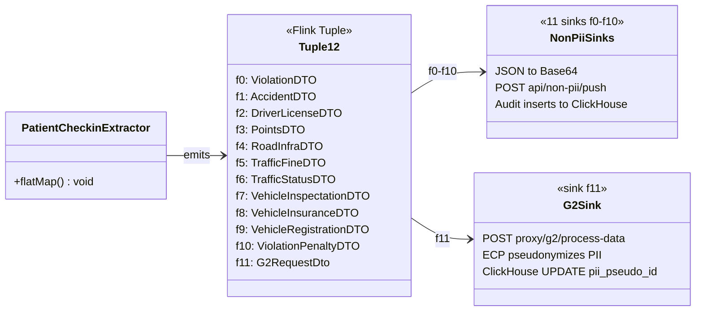
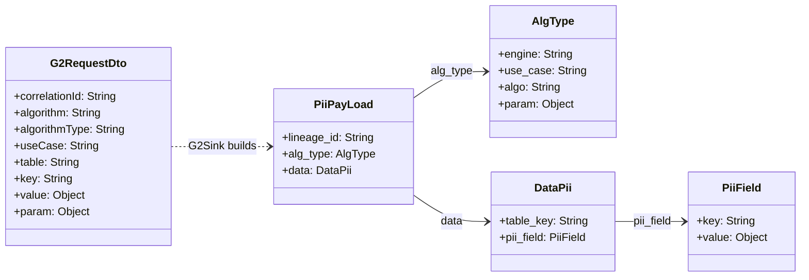
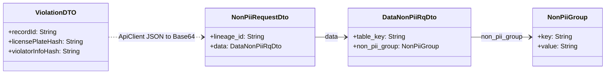

# Class Diagram: `ndip25.etl.flink`

## Diagram 1: Tổng thể

```mermaid
classDiagram
    direction TB

    %% FLINK BASE CLASSES
    class RichFlatMapFunction {
        <<Flink Abstract>>
        +open(params: Configuration) void
        +flatMap(value: IN, out: Collector~OUT~) void
        +close() void
    }

    class RichSinkFunction {
        <<Flink Abstract>>
        +open(params: Configuration) void
        +invoke(value: IN, ctx: Context) void
        +close() void
    }

    %% PIPELINE ENTRY POINT
    class App {
        +main(args: String[]) void
        -processStreams(stream: DataStream~Tuple12~) void
    }

    %% PIPELINE STAGES
    class MinioXmlFetcher {
        +flatMap(json: String, out: Collector~FileContentDto~) void
    }

    class FullXmlParser {
        +flatMap(dto: FileContentDto, out: Collector~FileContentGdDto~) void
    }

    class PatientCheckinExtractor {
        -piiConfigMap: Map~String,PiiConfig~
        -connection: Connection
        +open(params: Configuration) void
        +flatMap(dto: FileContentGdDto, out: Collector~Tuple12~) void
    }

    %% SINKS
    class G2Sink {
        -batchSize: int
        -flushIntervalMs: long
        -batch: List~G2RequestDto~
        -scheduler: ScheduledExecutorService
        -client: HttpClient
        +open(params: Configuration) void
        +invoke(dto: G2RequestDto, ctx: Context) void
        -flushBatch() void
        +callG2Api(dto: G2RequestDto) void
        +close() void
    }

    class ViolationSink {
        -batchSize: int
        -flushIntervalMs: long
        -batch: List~ViolationDTO~
        -scheduler: ScheduledExecutorService
        +open(params: Configuration) void
        +invoke(dto: ViolationDTO, ctx: Context) void
        -flushBatch() void
        +close() void
    }

    class OtherNonPiiSinks {
        <<10 sinks>>
        AccidentSink
        DriverLicenseSink
        TrafficFineSink
        TrafficStatusSink
        VehicleInspectationSink
        VehicleInsuranceSink
        VehicleRegistrationSink
        ViolationPenaltySink
        PointSink
        RoadInfraSink
    }

    %% UTILITIES
    class ApiClient {
        <<static utility>>
        +pushNonPii(tableKey: String, recordId: String, base64: String)$ void
    }

    class PiiConfigLoader {
        <<static utility>>
        +load()$ Map~String,PiiConfig~
    }

    class FlattenUtil {
        <<static utility>>
        +flatten(obj: Object)$ Map~String,Object~
    }

    class Contants {
        <<constants>>
        +Url_G2_ECP_Pii: String
        +Url_G3NonPii: String
        +Connect_KAFKA_HOST: String
        +Connect_KAFKA_TOPIC: String
        +Keys_CO8_FILE: String
        +DB_VIOLATION: String
        +DB_ACCIDENT: String
    }

    class Enums {
        <<enum>>
        PSQL_URL
        PSQL_USER
        PSQL_PASS
        CLICK_URL
        CLICK_USER
        CLICK_PASS
        INSERT_SUCCESS
        INSERT_ERROR
        ERROR_PARSE_XML_PAYLOAD
        +getMessage() String
    }

    class ObjectMapperFactory {
        <<static factory>>
        +create()$ ObjectMapper
    }

    %% DTOs - PIPELINE
    class FileContentDto {
        +lineageId: String
        +pathFile: String
        +nameFile: String
        +source: String
    }

    class FileContentGdDto {
        +fileName: String
        +pathFile: String
        +content: PhuongTienTongHop
    }

    class PhuongTienTongHop {
        <<XML Root POJO>>
    }

    %% DTOs - PII path
    class G2RequestDto {
        +correlationId: String
        +eventTime: long
        +template: String
        +algorithm: String
        +algorithmType: String
        +useCase: String
        +table: String
        +key: String
        +value: Object
        +param: Object
        +data: Map~String,Object~
    }

    class PiiPayLoad {
        +lineage_id: String
        +alg_type: AlgType
        +data: DataPii
    }

    class AlgType {
        +engine: String
        +use_case: String
        +algo: String
        +param: Object
    }

    class DataPii {
        +table_key: String
        +pii_field: PiiField
    }

    class PiiField {
        +key: String
        +value: Object
    }

    class PiiConfig {
        +algorithm: String
        +fieldPath: String
        +fieldName: String
        +param: Object
        +algorithmType: String
        +useCase: String
    }

    %% DTOs - NonPII path
    class NonPiiRequestDto {
        +lineage_id: String
        +data: DataNonPiiRqDto
    }

    class DataNonPiiRqDto {
        +table_key: String
        +non_pii_group: NonPiiGroup
    }

    class NonPiiGroup {
        +key: String
        +value: String
    }

    %% DTOs - Database
    class ViolationDTO {
        +id: UUID
        +recordId: String
        +source: String
        +incidentCodeHash: String
        +violatorInfoHash: String
        +violatorIdNumberHash: String
        +licensePlateHash: String
        +ownerNameHash: String
        +ownerIdNumberHash: String
        +registerNumberHash: String
        +chassisEngineNumberHash: String
        +violationDatetime: LocalDateTime
        +province: String
        +district: String
        +ward: String
    }

    class OtherDatabaseDTOs {
        <<10 DTOs>>
        AccidentDTO
        DriverLicenseDTO
        PointsDTO
        RoadInfraDTO
        TrafficFineDTO
        TrafficStatusDTO
        VehicleInspectationDTO
        VehicleInsuranceDTO
        VehicleRegistrationDTO
        ViolationPenaltyDTO
    }

    %% INHERITANCE
    MinioXmlFetcher --|> RichFlatMapFunction
    FullXmlParser --|> RichFlatMapFunction
    PatientCheckinExtractor --|> RichFlatMapFunction
    G2Sink --|> RichSinkFunction
    ViolationSink --|> RichSinkFunction
    OtherNonPiiSinks --|> RichSinkFunction

    %% APP ORCHESTRATION
    App --> MinioXmlFetcher : stage 1
    App --> FullXmlParser : stage 2
    App --> PatientCheckinExtractor : stage 3
    App --> G2Sink : addSink f11
    App --> ViolationSink : addSink f0
    App --> OtherNonPiiSinks : addSink f1-f10
    App --> Contants : config

    %% DATA FLOW
    MinioXmlFetcher ..> FileContentDto : emits
    FullXmlParser ..> FileContentGdDto : emits
    FileContentGdDto --> PhuongTienTongHop : contains
    PatientCheckinExtractor --> FlattenUtil : flatten
    PatientCheckinExtractor --> PiiConfigLoader : load on open
    PiiConfigLoader ..> PiiConfig : returns
    PatientCheckinExtractor ..> G2RequestDto : emits f11
    PatientCheckinExtractor ..> ViolationDTO : emits f0
    PatientCheckinExtractor ..> OtherDatabaseDTOs : emits f1-f10

    %% SINK INTERNALS
    G2Sink --> G2RequestDto : batches
    G2Sink ..> PiiPayLoad : builds for HTTP
    PiiPayLoad --> AlgType : alg_type
    PiiPayLoad --> DataPii : data
    DataPii --> PiiField : pii_field
    G2Sink --> Contants : G2_ECP_Pii URL

    ViolationSink --> ViolationDTO : batches
    ViolationSink --> ApiClient : pushNonPii
    ViolationSink --> ObjectMapperFactory : create
    OtherNonPiiSinks --> ApiClient : pushNonPii

    ApiClient ..> NonPiiRequestDto : builds
    NonPiiRequestDto --> DataNonPiiRqDto : data
    DataNonPiiRqDto --> NonPiiGroup : non_pii_group
    ApiClient --> Contants : G3NonPii URL
```

---

## Diagram 2: Tuple12 Split

```mermaid
classDiagram
    direction LR

    class Tuple12 {
        <<Flink Tuple>>
        f0: ViolationDTO
        f1: AccidentDTO
        f2: DriverLicenseDTO
        f3: PointsDTO
        f4: RoadInfraDTO
        f5: TrafficFineDTO
        f6: TrafficStatusDTO
        f7: VehicleInspectationDTO
        f8: VehicleInsuranceDTO
        f9: VehicleRegistrationDTO
        f10: ViolationPenaltyDTO
        f11: G2RequestDto
    }

    class PatientCheckinExtractor {
        +flatMap() void
    }

    class NonPiiSinks {
        <<11 sinks f0-f10>>
        JSON to Base64
        POST api/non-pii/push
        Audit inserts to ClickHouse
    }

    class G2Sink {
        <<sink f11>>
        POST proxy/g2/process-data
        ECP pseudonymizes PII
        ClickHouse UPDATE pii_pseudo_id
    }

    PatientCheckinExtractor --> Tuple12 : emits
    Tuple12 --> NonPiiSinks : f0-f10
    Tuple12 --> G2Sink : f11
```

---

## Diagram 3: PII DTO Chain (G2 path)

```mermaid
classDiagram
    direction LR

    class G2RequestDto {
        +correlationId: String
        +algorithm: String
        +algorithmType: String
        +useCase: String
        +table: String
        +key: String
        +value: Object
        +param: Object
    }

    class PiiPayLoad {
        +lineage_id: String
        +alg_type: AlgType
        +data: DataPii
    }

    class AlgType {
        +engine: String
        +use_case: String
        +algo: String
        +param: Object
    }

    class DataPii {
        +table_key: String
        +pii_field: PiiField
    }

    class PiiField {
        +key: String
        +value: Object
    }

    G2RequestDto ..> PiiPayLoad : G2Sink builds
    PiiPayLoad --> AlgType : alg_type
    PiiPayLoad --> DataPii : data
    DataPii --> PiiField : pii_field
```

---

## Diagram 4: NonPII DTO Chain (Audit path)

```mermaid
classDiagram
    direction LR

    class ViolationDTO {
        +recordId: String
        +licensePlateHash: String
        +violatorInfoHash: String
    }

    class NonPiiRequestDto {
        +lineage_id: String
        +data: DataNonPiiRqDto
    }

    class DataNonPiiRqDto {
        +table_key: String
        +non_pii_group: NonPiiGroup
    }

    class NonPiiGroup {
        +key: String
        +value: String
    }

    ViolationDTO ..> NonPiiRequestDto : ApiClient JSON to Base64
    NonPiiRequestDto --> DataNonPiiRqDto : data
    DataNonPiiRqDto --> NonPiiGroup : non_pii_group
```
