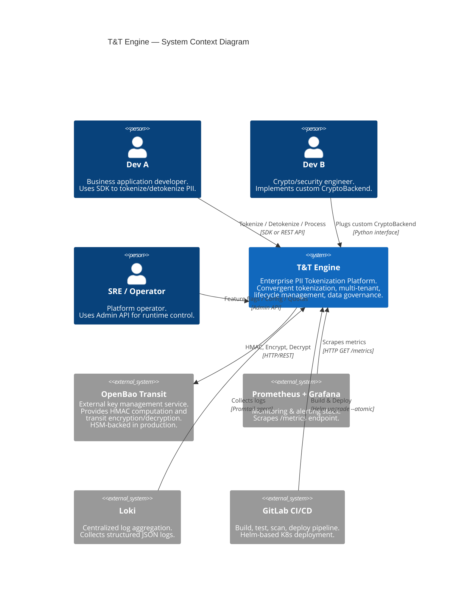
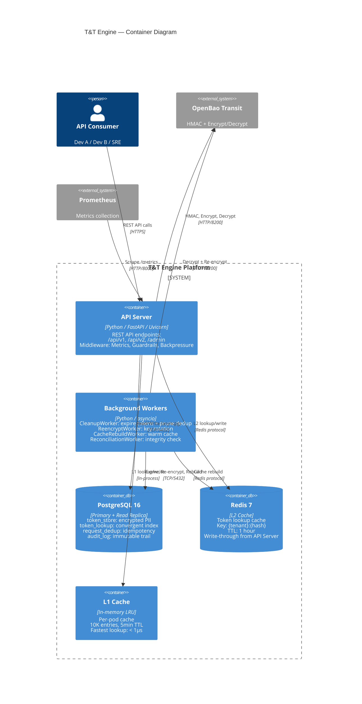
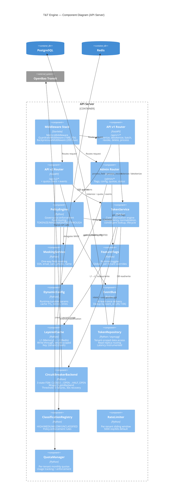
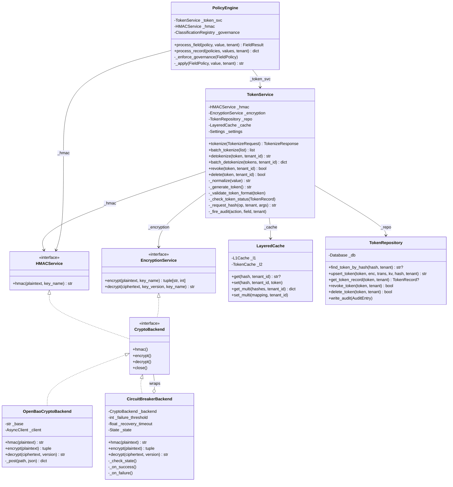

# T&T Engine — C4 Architecture Diagrams

---

## Level 1: System Context

Ai/hệ thống nào tương tác với T&T Engine, và tương tác như thế nào.



```
┌─────────────┐     ┌──────────────┐     ┌─────────────────┐
│   Dev A     │     │    Dev B     │     │  SRE / Operator │
│ (Business)  │     │  (Crypto)   │     │                 │
└──────┬──────┘     └──────┬──────┘     └────────┬────────┘
       │ SDK/REST          │ CryptoBackend        │ Admin API
       │                   │ interface            │
       ▼                   ▼                      ▼
┌──────────────────────────────────────────────────────────┐
│                                                          │
│                    T&T ENGINE                            │
│         Enterprise PII Tokenization Platform             │
│                                                          │
│  Convergent tokenization · Multi-tenant · Lifecycle      │
│  Data governance · Rate limiting · Quotas                │
│                                                          │
└──────┬──────────────┬──────────────────┬─────────────────┘
       │              │                  │
       ▼              ▼                  ▼
┌──────────────┐ ┌──────────┐  ┌─────────────────────┐
│ OpenBao      │ │Prometheus│  │ GitLab CI/CD        │
│ Transit      │ │+ Grafana │  │                     │
│              │ │          │  │ Build → Test → Scan  │
│ HMAC         │ │ Scrapes  │  │ → Deploy (Helm)     │
│ Encrypt      │ │ /metrics │  │                     │
│ Decrypt      │ └──────────┘  └─────────────────────┘
└──────────────┘
```

---

## Level 2: Container Diagram

Các container (process/runtime) bên trong platform và data store nào được sử dụng.



```
┌─────────────────────────────────────────────────────────────────────┐
│                        T&T ENGINE PLATFORM                          │
│                                                                     │
│  ┌─────────────────────────────────────────────────────────────┐   │
│  │              API SERVER (FastAPI / Uvicorn)                  │   │
│  │                                                             │   │
│  │  ┌──────────────┐  ┌──────────────┐  ┌──────────────┐     │   │
│  │  │  /api/v1     │  │  /api/v2     │  │  /admin      │     │   │
│  │  │  Tokenize    │  │  + Quotas    │  │  Flags       │     │   │
│  │  │  Detokenize  │  │  + Events    │  │  Config      │     │   │
│  │  │  Revoke      │  │              │  │  Quotas      │     │   │
│  │  │  Delete      │  │              │  │  Status      │     │   │
│  │  │  Process     │  │              │  │  Cache       │     │   │
│  │  └──────────────┘  └──────────────┘  └──────────────┘     │   │
│  │                                                             │   │
│  │  Middleware: [Metrics] → [Guardrails] → [Backpressure]     │   │
│  └──────┬──────────┬───────────────┬───────────────────────────┘   │
│         │          │               │                               │
│  ┌──────▼──────┐   │        ┌──────▼──────────────┐               │
│  │ L1 Cache    │   │        │ Background Workers  │               │
│  │ In-memory   │   │        │                     │               │
│  │ LRU 10K     │   │        │ · CleanupWorker     │               │
│  │ TTL: 5min   │   │        │ · ReencryptWorker   │               │
│  └─────────────┘   │        │ · CacheRebuildWorker│               │
│                     │        │ · ReconciliationWkr │               │
│                     │        └──────┬──────────────┘               │
│                     │               │                              │
│         ┌───────────┼───────────────┤                              │
│         ▼           ▼               ▼                              │
│  ┌─────────────┐  ┌──────────────────┐                            │
│  │   Redis 7   │  │  PostgreSQL 16   │                            │
│  │   L2 Cache  │  │                  │                            │
│  │             │  │ ┌──────────────┐ │                            │
│  │ {tenant}:   │  │ │ token_store  │ │                            │
│  │ {hash}      │  │ │ token_lookup │ │                            │
│  │ → token     │  │ │ request_dedup│ │                            │
│  │             │  │ │ audit_log    │ │                            │
│  │ TTL: 1hr    │  │ └──────────────┘ │                            │
│  └─────────────┘  │                  │                            │
│                    │ Primary + Read   │                            │
│                    │ Replica          │                            │
│                    └──────────────────┘                            │
└─────────────────────────┬─────────────────────────────────────────┘
                          │
                          ▼
                   ┌──────────────┐
                   │ OpenBao      │
                   │ Transit API  │
                   │              │
                   │ /transit/    │
                   │   hmac/      │
                   │   encrypt/   │
                   │   decrypt/   │
                   └──────────────┘
```

---

## Level 3: Component Diagram

Các component bên trong API Server container — logic phân tầng chi tiết.



```
┌────────────────────────────────────────────────────────────────────────────────┐
│                           API SERVER COMPONENTS                                │
│                                                                                │
│  ┌─────────────────────────────────────────────────────────────────────────┐   │
│  │                      MIDDLEWARE STACK                                    │   │
│  │   [MetricsMiddleware] → [GuardrailsMiddleware] → [BackpressureMW]      │   │
│  │    req count/latency     body≤1MB, timeout≤30s    inflight≤200         │   │
│  └───────────┬──────────────────┬──────────────────────┬───────────────────┘   │
│              │                  │                      │                       │
│  ┌───────────▼────┐ ┌──────────▼─────────┐ ┌──────────▼────────────┐         │
│  │  API v1 Router │ │   API v2 Router    │ │   Admin Router       │         │
│  │  /api/v1/*     │ │   /api/v2/*        │ │   /admin/*           │         │
│  │                │ │                    │ │                      │         │
│  │ · tokenize     │ │ · tokenize         │ │ · GET/POST flags    │         │
│  │ · detokenize   │ │   + quota check    │ │ · GET/POST config   │         │
│  │ · batch (x2)   │ │   + event emit     │ │ · GET/POST quota    │         │
│  │ · revoke       │ │ · batch            │ │ · POST cache/rebuild│         │
│  │ · delete       │ │   + quota + events │ │ · GET status        │         │
│  │ · process/field│ │ · detokenize       │ │ · POST rate-limit   │         │
│  │ · process/rec  │ │ · revoke + event   │ │   /reset            │         │
│  │ · health       │ │ · delete + event   │ │                      │         │
│  │ · ready        │ │                    │ │                      │         │
│  └──┬─────────┬───┘ └──┬──────┬────┬────┘ └──┬──────┬──────┬────┘         │
│     │         │         │      │    │         │      │      │              │
│  ┌──▼─────────▼─────────▼──┐   │    │    ┌────▼──┐ ┌─▼────┐ │              │
│  │      PolicyEngine       │   │    │    │Feature│ │Dyn.  │ │              │
│  │                         │   │    │    │Flags  │ │Config│ │              │
│  │ ┌─────────────────────┐ │   │    │    └───────┘ └──────┘ │              │
│  │ │ClassificationRegistry│ │   │    │                      │              │
│  │ │ HIGH → TOKENIZE only │ │   │    │              ┌───────▼──────┐       │
│  │ │ MEDIUM → +MASK,HASH │ │   │    │              │ QuotaManager │       │
│  │ │ LOW → +PASSTHROUGH   │ │   │    │              └──────────────┘       │
│  │ └─────────────────────┘ │   │    │                                     │
│  │                         │   │    │              ┌──────────────┐        │
│  │ Routes to:              │   │    └─────────────▶│  EventBus    │        │
│  │  · TokenService (TOK)   │   │                   │ event_id dedup│       │
│  │  · MaskingService (MASK)│   │                   │ LRU 10K      │        │
│  │  · HMACService (HASH)   │   │                   └──────────────┘        │
│  └──────────┬──────────────┘   │                                           │
│             │                  │         ┌──────────────┐                  │
│             │                  │         │ RateLimiter   │                  │
│             ▼                  │         │ 5000 req/60s  │                  │
│  ┌──────────────────────────────────┐    │ per tenant    │                  │
│  │         TokenService             │    └──────────────┘                  │
│  │                                  │                                      │
│  │  normalize → HMAC → cache lookup │                                      │
│  │  → DB lookup → encrypt → upsert │                                      │
│  │  → cache backfill → dedup store  │                                      │
│  │                                  │                                      │
│  │  Idempotent · Convergent         │                                      │
│  │  Concurrent-safe · Lifecycle-aware│                                     │
│  └──┬──────────┬──────────┬─────────┘                                      │
│     │          │          │                                                │
│  ┌──▼────┐  ┌──▼────┐  ┌──▼──────────────────────┐                        │
│  │Layered│  │Token  │  │CircuitBreakerBackend    │                        │
│  │Cache  │  │Repo   │  │                          │                        │
│  │       │  │       │  │ CLOSED ─(5 fails)→ OPEN │                        │
│  │L1: LRU│  │asyncpg│  │ OPEN ──(30s)────→ HALF  │                        │
│  │L2: Red│  │tenant │  │ HALF ──(success)→ CLOSED│                        │
│  │       │  │scoped │  │                          │                        │
│  └──┬──┬─┘  └──┬────┘  └──────────┬───────────────┘                        │
│     │  │       │                  │                                        │
└─────┼──┼───────┼──────────────────┼────────────────────────────────────────┘
      │  │       │                  │
      ▼  ▼       ▼                  ▼
   ┌────┐┌─────┐┌──────────┐┌──────────────┐
   │ L1 ││Redis││PostgreSQL││ OpenBao      │
   │mem ││ L2  ││ Primary  ││ Transit API  │
   │    ││     ││ + Replica││              │
   └────┘└─────┘└──────────┘└──────────────┘
```

---

## Level 4: Code Diagram — Tokenization Flow

Chi tiết class-level cho flow tokenize (operation quan trọng nhất).



```
┌─────────────────────────────────────────────────────────────────┐
│                     CLASS RELATIONSHIPS                          │
│                                                                 │
│  ┌────────────────────────────────────────────────────────┐     │
│  │                   PolicyEngine                         │     │
│  │  _token_svc ──▶ TokenService                          │     │
│  │  _hmac ────────▶ HMACService (interface)              │     │
│  │  _governance ──▶ ClassificationRegistry               │     │
│  └────────────────────┬───────────────────────────────────┘     │
│                       │                                         │
│                       ▼                                         │
│  ┌────────────────────────────────────────────────────────┐     │
│  │                   TokenService                         │     │
│  │                                                        │     │
│  │  _hmac ─────────▶ HMACService ◀─────────┐            │     │
│  │  _encryption ───▶ EncryptionService ◀────┤            │     │
│  │  _repo ─────────▶ TokenRepository        │            │     │
│  │  _cache ────────▶ LayeredCache            │            │     │
│  └───────────────────────────────────────────┤────────────┘     │
│                                              │                  │
│                                    ┌─────────▼──────────┐       │
│                         ┌─────────│  CryptoBackend     │       │
│                         │         │  <<interface>>      │       │
│                         │         │  hmac()             │       │
│                         │         │  encrypt()          │       │
│                         │         │  decrypt()          │       │
│                         │         └─────────┬──────────┘       │
│                         │                   │                   │
│              ┌──────────▼────────┐  ┌───────▼────────────┐     │
│              │CircuitBreaker     │  │SandboxCrypto       │     │
│              │Backend            │  │Backend             │     │
│              │                   │  │(dev/test only)     │     │
│              │ wraps any         │  └────────────────────┘     │
│              │ CryptoBackend     │                              │
│              │                   │                              │
│              │ _backend ────────▶│  OpenBaoCrypto               │
│              │                   │  Backend                     │
│              │ States:           │  (production)                │
│              │ CLOSED→OPEN       │                              │
│              │ →HALF_OPEN        │                              │
│              └───────────────────┘                              │
│                                                                 │
│  ┌─────────────────┐        ┌──────────────────────┐           │
│  │  LayeredCache    │        │  TokenRepository     │           │
│  │                  │        │                      │           │
│  │ ┌──────┐        │        │  _db.pool (write)    │           │
│  │ │  L1  │ LRU    │        │  _db.read_pool (read)│           │
│  │ │ 10K  │ 5min   │        │                      │           │
│  │ └──┬───┘        │        │  @_track(operation)  │           │
│  │    ▼            │        │  → DB_LATENCY hist   │           │
│  │ ┌──────┐        │        │  → DB_ERRORS counter │           │
│  │ │  L2  │ Redis  │        │                      │           │
│  │ │ 50cn │ 1hr    │        └──────────────────────┘           │
│  │ └──────┘        │                                           │
│  └─────────────────┘                                           │
└─────────────────────────────────────────────────────────────────┘
```

---

## Level 3.5: Data Flow Diagram — Tokenize Request

Dòng dữ liệu chi tiết khi một request tokenize đi qua hệ thống.

```
Request: POST /api/v1/tokenize
Body: {"value": "123-45-6789", "field": "ssn", "tenant_id": "acme"}

    ┌────────┐
    │ Client │
    └───┬────┘
        │ HTTP POST
        ▼
┌───────────────────────────────────────────────────────────────┐
│ MIDDLEWARE STACK                                               │
│                                                               │
│ 1. MetricsMiddleware                                          │
│    · Generate/propagate trace_id                              │
│    · Start latency timer                                      │
│                                                               │
│ 2. GuardrailsMiddleware                                       │
│    · Check: body size ≤ 1MB? ─── NO ──▶ 413 Payload Too Large│
│    · Enforce: 30s timeout                                     │
│                                                               │
│ 3. BackpressureMiddleware                                     │
│    · Check: inflight < 200? ──── NO ──▶ 503 + Retry-After: 1 │
│    · Increment inflight counter                               │
└───────────────────────┬───────────────────────────────────────┘
                        │
                        ▼
┌───────────────────────────────────────────────────────────────┐
│ TokenService.tokenize(req)                                    │
│                                                               │
│ ① IDEMPOTENCY CHECK                                          │
│    hash = SHA256("tokenize:acme:123-45-6789:ssn")             │
│    dedup = await repo.get_dedup(hash, "acme")                 │
│    ── hit? ──▶ return cached response (skip everything below) │
│                                                               │
│ ② NORMALIZE                                                   │
│    "  123-45-6789  " → "123-45-6789" (NFC + strip)           │
│                                                               │
│ ③ HMAC (via CircuitBreaker → OpenBao)                        │
│    hmac_hash = await crypto.hmac("123-45-6789")               │
│    ── circuit OPEN? ──▶ raise CryptoServiceUnavailableError   │
│    Result: "vault:v1:a3f8c2d1..."                             │
│                                                               │
│ ④ CACHE LOOKUP (3-layer)                                      │
│    L1.get("acme:vault:v1:a3f8c2d1...")                        │
│    ── L1 hit? ──▶ return token (fastest path, < 1μs)          │
│    L2.get("acme:vault:v1:a3f8c2d1...")                        │
│    ── L2 hit? ──▶ backfill L1, return token                   │
│                                                               │
│ ⑤ DB LOOKUP                                                   │
│    token = await repo.find_token_by_hash(hash, "acme")        │
│    ── DB hit? ──▶ backfill L1+L2, return token                │
│                                                               │
│ ⑥ CREATE NEW TOKEN (cold path)                                │
│    proposed = "tok_" + secrets.token_urlsafe(32)              │
│    ciphertext, key_ver = await crypto.encrypt("123-45-6789")  │
│    ── Result: ("vault:v1:encrypted...", 1)                    │
│                                                               │
│ ⑦ CONCURRENCY-SAFE UPSERT                                    │
│    winning = await repo.upsert_token(                         │
│        proposed, ciphertext, "TOKENIZE", 1, hash, "acme"      │
│    )                                                          │
│    ── race lost? ──▶ winning ≠ proposed (use winner's token)  │
│                                                               │
│ ⑧ CACHE BACKFILL                                              │
│    await cache.set(hash, "acme", winning)  [L1 + L2]          │
│                                                               │
│ ⑨ DEDUP STORE                                                 │
│    await repo.set_dedup(req_hash, "acme", response_dict)      │
│                                                               │
│ ⑩ AUDIT (fire-and-forget)                                     │
│    asyncio.create_task(write_audit(TOKENIZE, "ssn", "acme"))  │
│                                                               │
│ Return: TokenizeResponse(token="tok_A3f8x...", field="ssn")   │
└───────────────────────────────────────────────────────────────┘
```

---

## Deployment Diagram (Kubernetes)

```
┌─────────────────────── Kubernetes Cluster ──────────────────────────┐
│                                                                     │
│  ┌─── tnt-engine namespace ─────────────────────────────────────┐  │
│  │                                                               │  │
│  │  Deployment: tnt-engine (RollingUpdate, maxUnavailable=0)    │  │
│  │  ┌────────┐ ┌────────┐ ┌────────┐          ┌────────┐       │  │
│  │  │ Pod 1  │ │ Pod 2  │ │ Pod 3  │   ...    │ Pod N  │       │  │
│  │  │ 250m-1 │ │ 250m-1 │ │ 250m-1 │          │        │       │  │
│  │  │ CPU    │ │ CPU    │ │ CPU    │          │        │       │  │
│  │  │ 256-   │ │ 256-   │ │ 256-   │          │        │       │  │
│  │  │ 512Mi  │ │ 512Mi  │ │ 512Mi  │          │        │       │  │
│  │  └────────┘ └────────┘ └────────┘          └────────┘       │  │
│  │                                                               │  │
│  │  HPA: min=3, max=20, CPU target=70%                          │  │
│  │  PDB: minAvailable=2                                         │  │
│  │                                                               │  │
│  │  Service ──▶ ClusterIP :80 → :8000                           │  │
│  │  Ingress ──▶ nginx, TLS (prod)                               │  │
│  │  NetworkPolicy ──▶ ingress: nginx+monitoring                 │  │
│  │                    egress: pg+redis+openbao+dns               │  │
│  │                                                               │  │
│  │  ┌────────────┐  ┌──────────┐  ┌──────────────┐             │  │
│  │  │ PostgreSQL │  │  Redis   │  │   OpenBao    │             │  │
│  │  │ Primary    │  │  7-alpine│  │   Transit    │             │  │
│  │  │ + Replica  │  │  256MB   │  │   :8200      │             │  │
│  │  └────────────┘  └──────────┘  └──────────────┘             │  │
│  └───────────────────────────────────────────────────────────────┘  │
│                                                                     │
│  ┌─── monitoring namespace ──────────────────────────────────────┐ │
│  │  Prometheus (ServiceMonitor → tnt-engine /metrics)            │ │
│  │  Grafana (3 dashboards: overview, infra, dependencies)        │ │
│  │  Alertmanager (8 rules → Slack #tnt-engine-alerts)            │ │
│  │  Loki + Promtail (structured JSON log collection)             │ │
│  └───────────────────────────────────────────────────────────────┘ │
└─────────────────────────────────────────────────────────────────────┘
```

---

## Cách render diagrams

### Mermaid (GitLab / GitHub / VS Code)
Các diagram Mermaid trong document này render tự động trên GitLab/GitHub markdown. Trong VS Code, cài extension "Markdown Preview Mermaid Support".

### PlantUML
Để convert sang PlantUML format, sử dụng C4-PlantUML library:
```
!include https://raw.githubusercontent.com/plantuml-stdlib/C4-PlantUML/master/C4_Container.puml
```

### Export sang PNG/SVG
```bash
# Mermaid CLI
npx -p @mermaid-js/mermaid-cli mmdc -i docs/c4-diagrams.md -o docs/c4-diagrams.png

# Hoặc dùng Kroki API
curl -X POST https://kroki.io/mermaid/svg -d @diagram.mermaid -o diagram.svg
```
